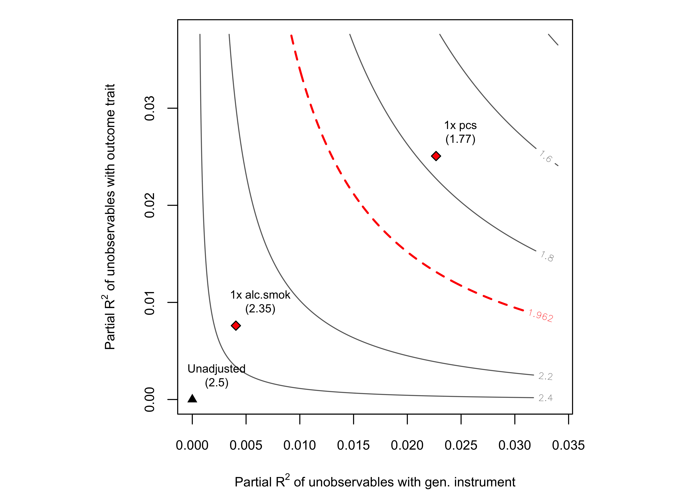

<!-- README.md is generated from README.Rmd. Please edit that file -->

# MR-SENSEMAKR

<!-- badges: start -->

<!-- badges: end -->

The R package `mrsensemakr` implements sensitivity analysis tools for
Mendelian Randomization, as discussed in [Cinelli et al (2020). Robust
Mendelian randomization in the presence of residual population
stratification, batch effects and horizontal
pleiotropy.](https://www.biorxiv.org/content/10.1101/2020.10.21.347773v1)

## Development version

<!-- commit -->

To install the development version on GitHub make sure you have the R
package `devtools` installed. Also make sure to have the latest version
of `sensemakr` [(link)](https://github.com/carloscinelli/sensemakr)
installed.

``` r
# install.packages("devtools")
devtools::install_github("carloscinelli/sensemakr")
devtools::install_github("carloscinelli/mrsensemakr")
```

CRAN version coming soon.

## Basic usage

``` r
## loads package
library(mrsensemakr)

## simulated data example
data("sim_data")

## create vectors indicating variable names in the data
outcome    <- "out.trait" # name of outcome trait
exposure   <- "exp.trait" # name of exposure trait
instrument <- "prs" # genetic instrument (e.g, polygenic risk score)
age.sex    <- c("age", "sex") # age and sex variables (if applicable)
alc.smok   <- c("alcohol", "smoking") # putative pleoitropic vars.
pcs        <- paste0("pc", 1:20) # first 20 principal components pc1 ... pc20

## runs MR sensitivity analysis
mr.sense <- mr_sensemakr(outcome = outcome,
                         exposure = exposure,
                         instrument = instrument,
                         covariates = c(age.sex, alc.smok, pcs), 
                         data = sim_data, 
                         benchmark_covariates = list(alc.smok = alc.smok,
                                                     pcs = pcs))
## print results
mr.sense
#> Sensitivity Analysis for Mendelian Randomization (MR)
#>  Exposure: exp.trait
#>  Outcome: out.trait
#>  Genetic instrument: prs
#> 
#> Traditional MR results (2SLS)
#>   MR Estimate (95% CI): 0.227 (0.192 - 0.262)
#>   P-value:  < 2x10^16
#> 
#> Sensitivity genetic instrument (prs) -> exposure (exp.trait)
#>   Partial R2: 1.45%
#>   RV (alpha = 0.05): 11.03%
#> 
#> Sensitivity genetic instrument (prs) -> outcome (out.trait)
#>   Partial R2: 0.07%
#>   RV (alpha = 0.05): 2.27%
#> 
#> Bounds on the maximum explanatory power of omitted variables W, if it were as strong as:
#>  bound_label r2zw.x r2dw.zx r2yw.zx
#>  1x alc.smok  0.26%   0.01%   0.02%
#>       1x pcs  0.25%   0.03%   0.01%


## sensitivity contour plots
plot(mr.sense, 
     benchmark_covariates = list(alc.smok = alc.smok,
                                 pcs = pcs),
     k = list(alc.smok = 25,
              pcs = 35))
```


